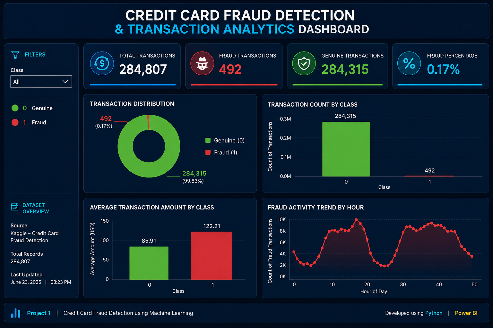

# 🛡️ AI-Based Banking Fraud Detection and Transaction Risk Analysis

## 📌 Project Overview

This project uses Machine Learning to detect fraudulent banking transactions and classify them as Genuine or Fraudulent. The project includes Exploratory Data Analysis (EDA), Machine Learning model development, and dashboard visualization.

---

## 🎯 Objectives

- Detect fraudulent banking transactions.
- Compare multiple Machine Learning algorithms.
- Improve fraud detection accuracy.
- Visualize transaction insights using dashboards.

---

## 🛠️ Technologies Used

- Python
- Jupyter Notebook
- Machine Learning
- Scikit-learn
- Pandas
- NumPy
- Matplotlib
- Power BI
- Git & GitHub

---

## 📂 Project Files

| File | Description |
|------|-------------|
| fraud_detection_ML.ipynb | Machine Learning Notebook |
| fraud_detection_model.pkl | Trained ML Model |
| Dashboard.png | Power BI Dashboard |
| Report_AI-Based Banking Fraud Detection.pdf | Project Report |
| PPT AI-Based Banking Fraud Detection.pdf | Project Presentation |

---

## 🤖 Machine Learning Models Used

- Logistic Regression
- Random Forest
- Support Vector Machine (SVM)

---

## 📊 Dashboard

The dashboard provides:

- Total Transactions
- Fraud vs Genuine Transactions
- Fraud Amount Analysis
- Fraud Distribution

## 📷 Dashboard Preview

---

## 📈 Project Workflow

1. Data Collection
2. Data Cleaning
3. Exploratory Data Analysis (EDA)
4. Feature Engineering
5. Model Training
6. Hyperparameter Tuning
7. Model Evaluation
8. Dashboard Creation

---

## 📌 Results

The Random Forest model achieved the best performance among the tested models and was selected for the final fraud detection system.

---

## 📧 Author

**Nazeera Bhanu**

Aspiring Data Analyst

GitHub: https://github.com/nazeerashayara-arch